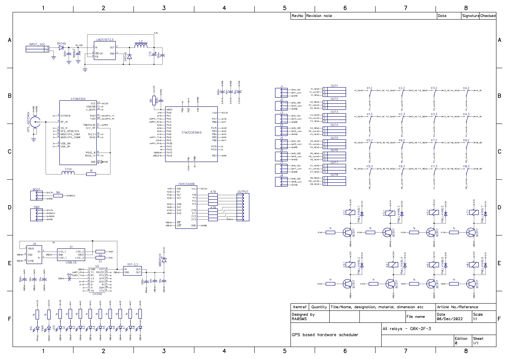
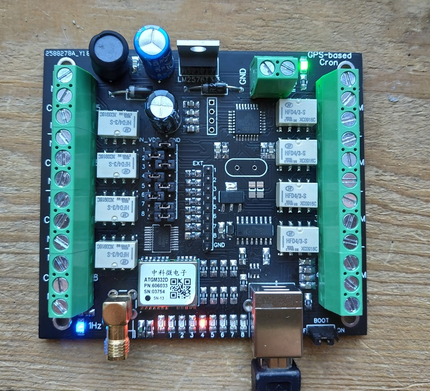
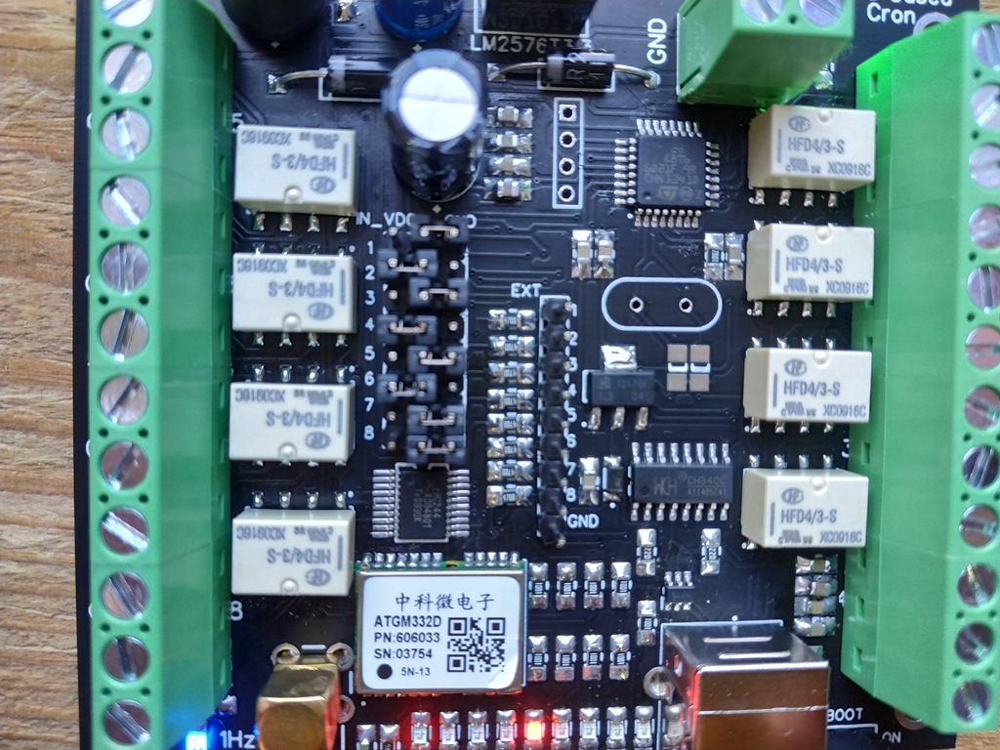
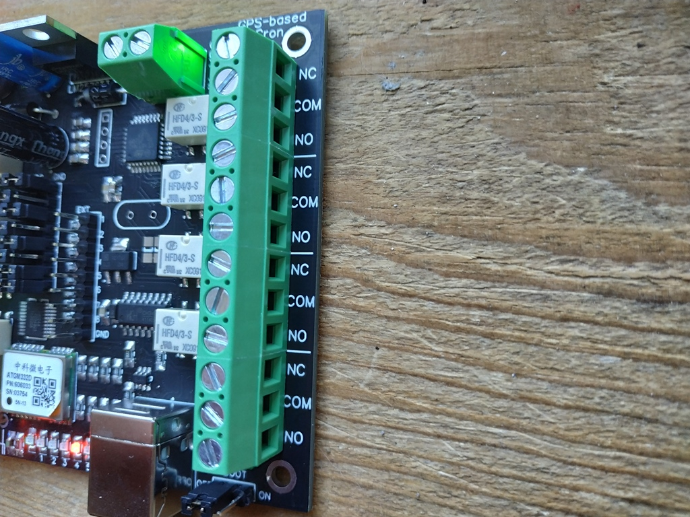

# GPS-based scheduler for International WSPR Beacon Project

## Introduction

[Globally deployed WSPR Beacons](https://github.com/HB9VQQ/WSPRBeacon) - Synchronized weak signal Network - same Power - same Band hopping schedule - 80,40,20,15,10m 24x7x365. Coordinated WSPR Band hopping transmit schedule following the [WSJT-X implementation](https://www.physics.princeton.edu/pulsar/K1JT/wsjtx-doc/wsjtx-main-2.3.0.html#_band_hopping)

The Timetable of Int. WSPR Beacon Project


For each enabled Band the scheduler will start to transmit at the corresponding Minute.

## What is the problem?

The WSPR beacon uses a transmitting antenna, which cannot be simultaneously tuned on all bands from 80 to 10 meters. SWR on different bands will not be optimal. Therefore, the question arises - how to improve this system, taking into account the fact that we are tied to the schedule.


## What should we do?

Since we have a schedule, we can switch antennas (or matching a multiband tuner near our antenna) between bands according to the schedule. We can also use GPS signals for synchronization. Thus the scheme of this device was created.



It is based on MCU STM32G030K8 and GPS receiver module ATGM332D. The source code for STM32CubeIDE you can find in `code` folder. The timetable for WSPR beacon is presented as arrays (see `code/core/src/main.c`):

```c
/*TIMETABLE FOR ALL BANDS*/
int time80[] = {2,22,42};
int time40[] = {6,26,46};
int time30[] = {8,28,48};
int time20[] = {10,30,50};
int time17[] = {12,32,52};
int time15[] = {14,34,54};
int time12[] = {16,36,56};
int time10[] = {18,38,58};
int timeOff1[] = {0,20,40};
int timeOff2[] = {4,24,44};
```

The output signals are a relay output that can switch ground or supply voltage. 



The voltage supply of the device is from 5 to 15V. The same voltage can be applied to outputs 1-8 using jumpers on the board.



`IN_VDC` - an active output is power supply

`GND` - an active output is ground.

Or you can remove any jumper and connect an external power supply to `COM` connector of each output.

