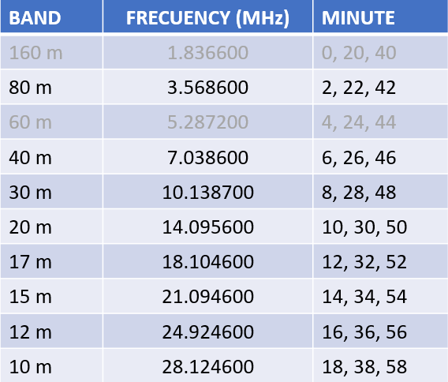
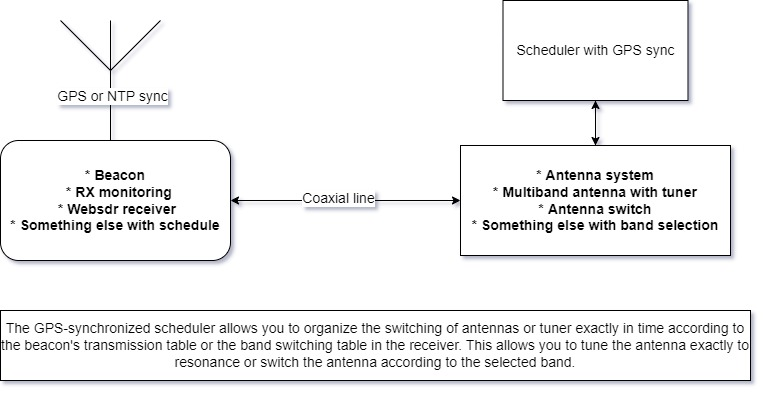

# GPS-based scheduler for International WSPR Beacon Project

## Introduction

[Globally deployed WSPR Beacons](https://github.com/HB9VQQ/WSPRBeacon) - Synchronized weak signal Network - same Power - same Band hopping schedule - 80,40,20,15,10m 24x7x365. Coordinated WSPR Band hopping transmit schedule following the [WSJT-X implementation](https://www.physics.princeton.edu/pulsar/K1JT/wsjtx-doc/wsjtx-main-2.3.0.html#_band_hopping)

The Timetable of Int. WSPR Beacon Project

For each enabled Band the scheduler will start to transmit at the corresponding Minute.

## What is the problem?

The WSPR beacon uses a transmitting antenna, which cannot be simultaneously tuned on all bands from 80 to 10 meters. SWR on different bands will not be optimal. Therefore, the question arises - how to improve this system, taking into account the fact that we are tied to the schedule.

