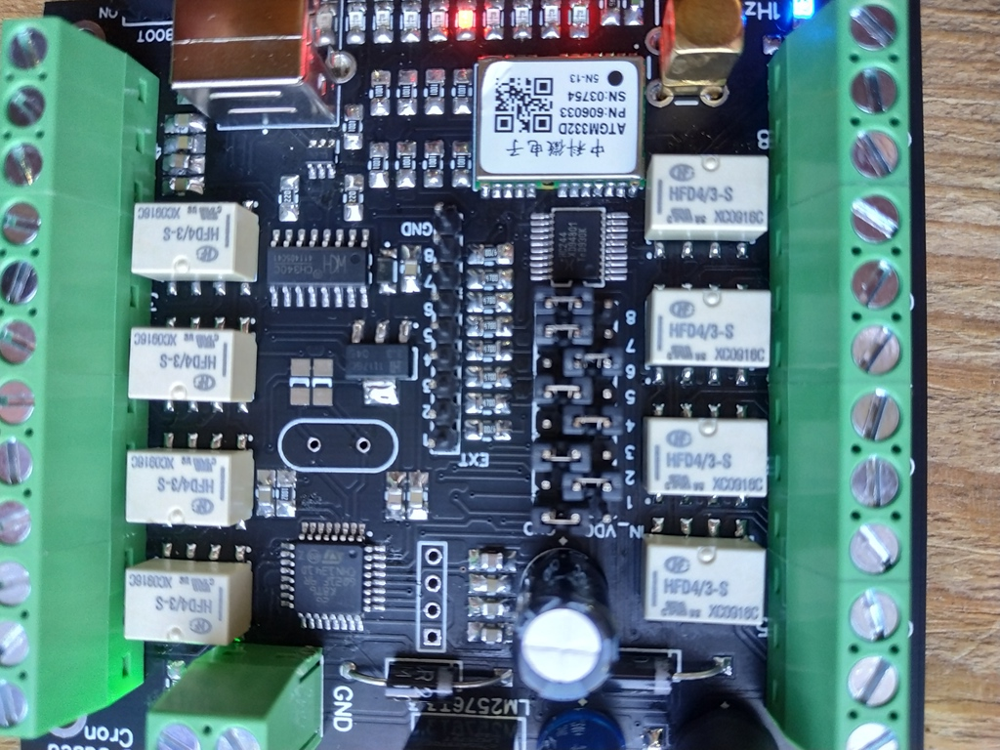
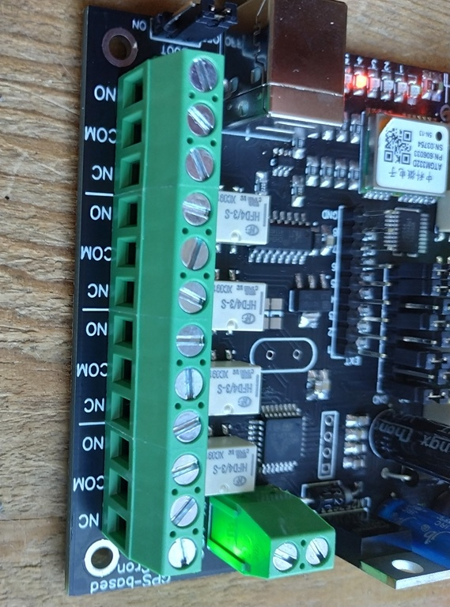

# GPS-based scheduler for International WSPR Beacon Project

## Introduction

[Globally deployed WSPR Beacons](https://github.com/HB9VQQ/WSPRBeacon) - Synchronized weak signal Network - same Power - same Band hopping schedule - 80,40,20,15,10m 24x7x365. Coordinated WSPR Band hopping transmit schedule following the [WSJT-X implementation](https://www.physics.princeton.edu/pulsar/K1JT/wsjtx-doc/wsjtx-main-2.3.0.html#_band_hopping)

The Timetable of Int. WSPR Beacon Project


For each enabled Band the scheduler will start to transmit at the corresponding Minute.

## What is the problem?

The WSPR beacon uses a transmitting antenna, which cannot be simultaneously tuned on all bands from 80 to 10 meters. SWR on different bands will not be optimal. Therefore, the question arises - how to improve this system, taking into account the fact that we are tied to the schedule.


## What should we do?

Since we have a schedule, we can switch antennas (or matching a multiband tuner near our antenna) between bands according to the schedule. We can also use GPS signals for synchronization. Thus the scheme of this device was created.


## Description

It is based on MCU STM32G030K8 and GPS receiver module ATGM332D. The source code for STM32CubeIDE you can find in `code` folder. The timetable for WSPR beacon is presented as arrays (see `code/core/src/main.c`):

```c
/*TIMETABLE FOR ALL BANDS*/
int time80[] = {2,22,42};		//set OUTPUT 1
int time40[] = {6,26,46};		//set OUTPUT 2
int time30[] = {8,28,48};		//set OUTPUT 3
int time20[] = {10,30,50};		//set OUTPUT 4
int time17[] = {12,32,52};		//set OUTPUT 5
int time15[] = {14,34,54};		//set OUTPUT 6
int time12[] = {16,36,56};		//set OUTPUT 7
int time10[] = {18,38,58};		//set OUTPUT 8
int timeOff1[] = {0,20,40};		//reset all outputs
int timeOff2[] = {4,24,44};		//reset all outputs
```

The output signals are a relay output that can switch ground or supply voltage. 


The voltage supply of the device is from 5 to 15V. The same voltage can be applied to outputs 1-8 using jumpers on the board.



`IN_VDC` - an active output is power supply

`GND` - an active output is ground.

Or you can remove any jumper and connect an external power supply to `COM` connector of each output.



Also the devise has `EXT` out which can use for external relay modules, for example like this one:


`EXT` connector provides high logic level (3.3V) for an active output.

### Technical specifications

**Power supply**: 5-15VDC

**Consumption current**: ~25mA (12VDC)

**Dimension**: 78*88mm

**Switched external voltage**: 0-30VDC

**Switched max current**: 200mA

**USB type B connector**

**RF connector for GPS antenna**: SMA-F

**Outputs**: 8 relay outputs and 8 TTL (3.3V) outputs for an external relay module

## Using

For example, consider the case of using 8 single-band antennas and an external antenna switch (12V for switching). It is necessary to set the jumpers on all outputs to the `IN_VDC` position. `NO` contacts of outputs 1-8 connect with the control cable of the antenna switch (with the corresponding antenna ports). Connect 12V power to the board and connect the GPS antenna. The `1Hz` LED on the board indicates the presence of synchronization with the GPS (it should blink once per second). LEDs 1 to 8 indicate the active output. After synchronizing with the GPS, the device will automatically switch antennas depending on the band on which it is currently transmitting.